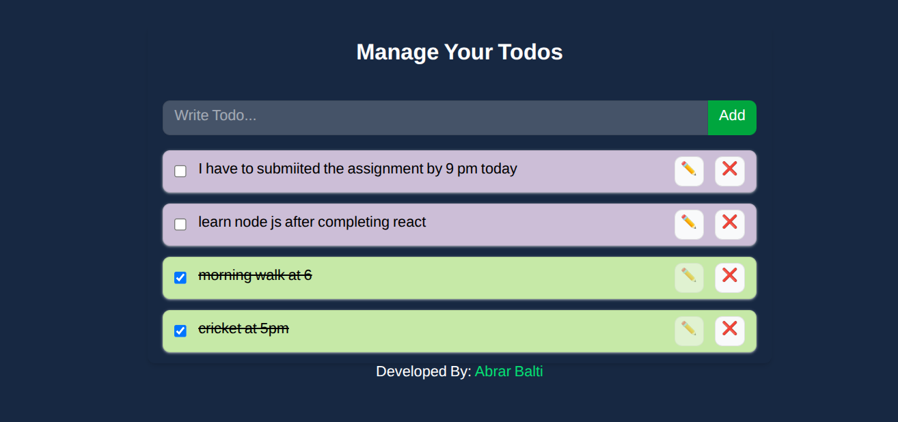

# React Todo App with Tailwind CSS

This is a simple Todo application built with React and Tailwind CSS.  
It allows you to add, update, delete, and toggle completion status of todos.

---

## Features

- Add new todos
- Edit existing todos
- Delete todos
- Mark todos as completed/uncompleted
- Add to local storage
- Responsive UI styled with Tailwind CSS

## 

## Setup & Installation

1. **Clone the repository**

```bash
git clone <your-repo-url>

```
